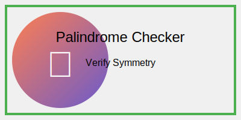
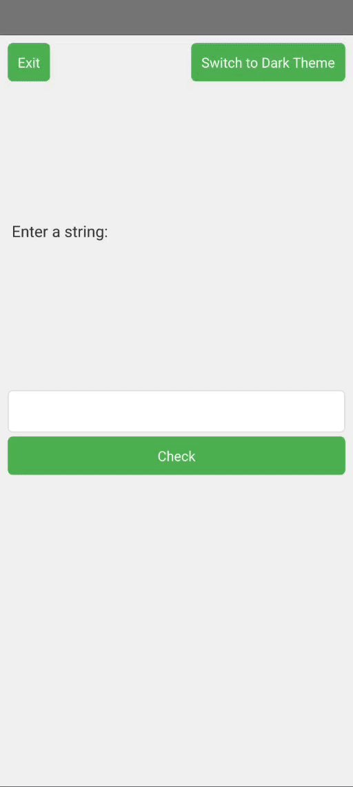

# Palindrome Checker GUI 🕵️‍♂️🔄
---
[In Python](https://github.com/mdriyadkhan585/palindrome-checker-python)

[In C Script](https://github.com/mdriyadkhan585/palindrome-checker-c)



---
Welcome to the Palindrome Checker GUI application! This Python application allows you to check if a string is a palindrome through a user-friendly graphical interface. It supports theme switching between light and dark modes and includes an exit button for convenience.

## Features ✨

- **Palindrome Detection**: Determines if the input string reads the same forwards and backwards.
- **Multi-Line Input**: Allows long strings to be entered.
- **Theme Switching**: Toggle between light and dark themes for a comfortable viewing experience.
- **Exit Button**: Easily close the application from the GUI.
---


---
## Installation 🛠️

1. **Ensure Python is Installed**: This application requires Python 3.6 or later. Download and install Python from [python.org](https://www.python.org/).

2. **Install Dependencies**:
   - Open a terminal or command prompt.
   - Install `PySide6` and `qtpy` using pip:

     ```bash
     pip install PySide6 qtpy
     ```

3. **Download the Code**:
   - Save the provided Python script as `palindrome_checker_gui.py`.

## Running the Application 🚀

1. **Open Terminal or Command Prompt**:
   - Navigate to the directory where `palindrome_checker_gui.py` is saved.

2. **Execute the Script**:
   - Run the application using Python:

     ```bash
     git clone https://github.com/mdriyadkhan585/palindrome-checker-gui
     cd palindrome-checker-gui
     python palindrome_checker_gui.py
     ```

3. **Interact with the GUI**:
   - **Enter a String**: Type the string you want to check in the input field.
   - **Check for Palindrome**: Click the "Check" button to see if the string is a palindrome.
   - **Switch Themes**: Click the "Switch to Dark Theme" or "Switch to Light Theme" button to toggle between themes.
   - **Exit the Application**: Click the "Exit" button to close the application.

## GUI Overview 🖥️

- **Input Field**: Where you enter the string to be checked.
- **Check Button**: Initiates the palindrome check and displays the result.
- **Result Label**: Shows whether the input string is a palindrome.
- **Theme Button**: Changes the theme of the application.
- **Exit Button**: Closes the application.

### Example Usage 🏆

```plaintext
Palindrome Checker GUI
==============================

Enter a string: A man a plan a canal Panama
✅ The input string is a palindrome.

Do you want to switch to Dark Theme? (Click the button)
```

## Code Overview 📝

### `PalindromeChecker` Class 🔍

- **`init_ui` Method**: Initializes the user interface, including input field, buttons, and result label.
- **`update_styles` Method**: Applies light or dark theme styles.
- **`toggle_theme` Method**: Switches between light and dark themes.
- **`check_palindrome` Method**: Checks if the input string is a palindrome and updates the result label.
- **`is_palindrome` Method**: Cleans and checks if the string is a palindrome.

## Troubleshooting 🛠️

- **Dependencies**: Ensure `PySide6` and `qtpy` are correctly installed.
- **Theme Issues**: If the theme button doesn't work, ensure the correct version of Python is used.

## Contributing 🤝

Contributions are welcome! If you have suggestions or improvements, please submit pull requests or report issues via [GitHub](https://github.com/mdriyadkhan585).

## License 📜

This project is licensed under the MIT License - see the [LICENSE](LICENSE) file for details.

---

Thank you for using the Palindrome Checker GUI! If you have any questions or need further assistance, feel free to reach out.

---
